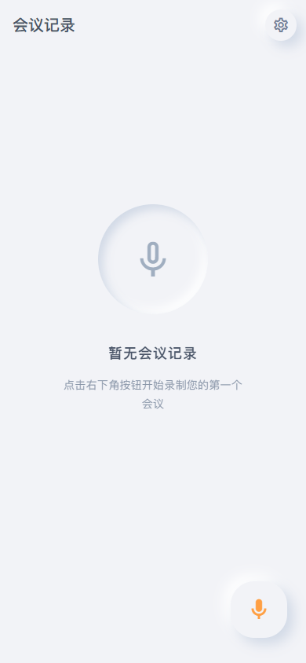
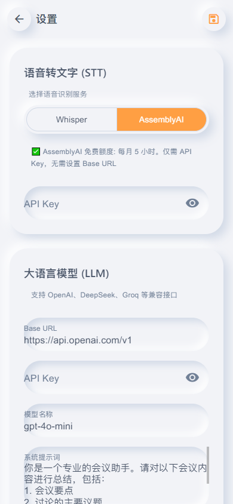
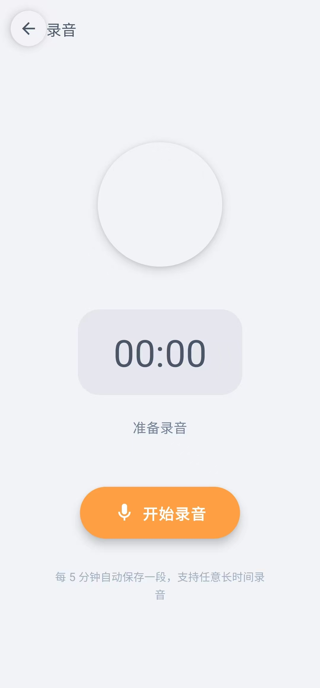
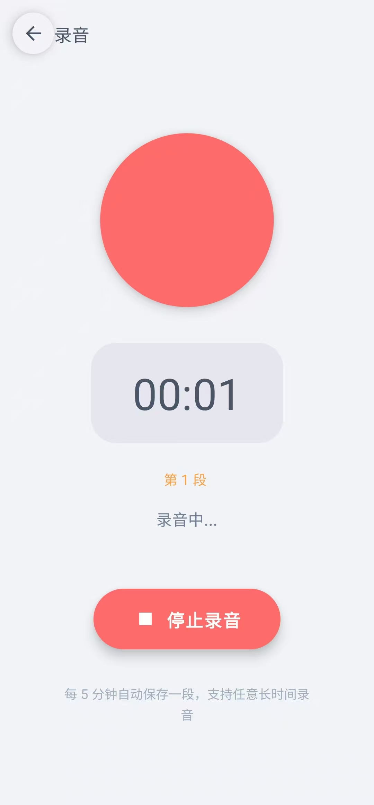
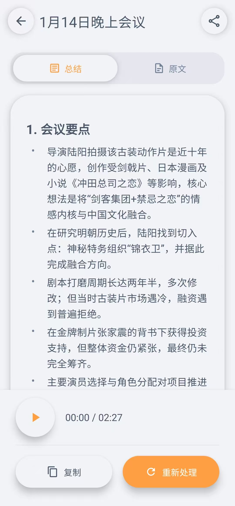
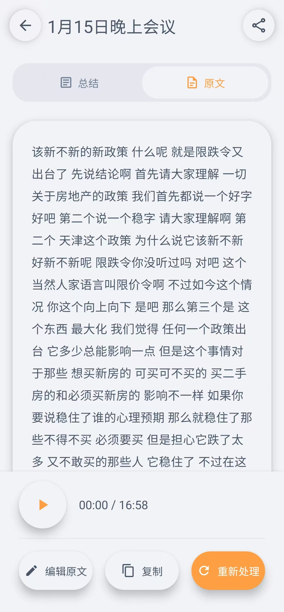

# MeetingAI 品牌手册（图文版）
版本：v1.0（基于当前项目 UI 体系与 `src/utils/skeuomorphicTheme.ts` 设计令牌整理）  
适用范围：App UI、产品截图、落地页视觉延展、发布物料（App Store / 应用市场图）

---

## 0. 快速预览（截图索引）













> 说明：本手册不对图片做像素级分析；视觉语言以项目既有代码令牌与组件结构为准，截图用于“应用场景示例”。

---

## 1. 品牌定义

### 1.1 品牌名称
- 中文：MeetingAI（会议录音助手）
- 英文：MeetingAI

### 1.2 一句话定位
- 把会议“录下来”，把信息“讲清楚”。

### 1.3 目标用户
- 高频会议人群：产品/工程/销售/咨询/HR
- 需要“可追溯原文 + 可快速阅读总结”的人
- 在移动端完成采集与回顾的人

### 1.4 品牌性格（我们希望给人的感觉）
- 温暖但专业：用柔和的拟物光影降低工具感
- 克制但高效：信息层级清晰，不用强刺激色块“压人”
- 可靠可追溯：总结与原文并存，允许编辑原文再生成总结

---

## 2. 语气与文案（Tone of Voice）

### 2.1 文案风格
- 短句、动作优先：先说“做什么”，再说“为什么”
- 低压力提醒：避免命令口吻；避免夸张感叹
- 状态透明：录音/转录/总结进度清晰显示（尤其是长音频）

### 2.2 推荐用语（示例）
- 配置引导：`请先配置 API` / `去设置`
- 录音状态：`准备录音` / `录音中...` / `已暂停`
- 处理状态：`正在转录语音...` / `正在生成总结...`
- 结果反馈：`处理完成` / `已复制到剪贴板`
- 错误反馈：`处理失败：{原因}`（原因必须可读、可行动）

### 2.3 禁用用语（不建议）
- “系统崩溃/致命错误/失败了哈哈”之类情绪化表达
- 不给下一步的报错（只有“失败”没有“原因/动作”）

---

## 3. 视觉方向（Visual Direction）

### 3.1 核心风格关键词
- Light Skeuomorphism（轻拟物 / 轻新拟态）
- 同色背景（Same Color Background）
- 双光源阴影（明/暗两侧柔影）
- 暖橙主色 + 珊瑚红录音强调
- 低对比度文字（避免纯黑，强调“耐看”）

### 3.2 设计原则（UI 层）
1. 背景统一：大面积使用同一底色，减少杂色分割
2. 通过“凹/凸”表达层级：按钮/卡片凸起，输入/承载区凹陷
3. 强调动作只用一处：录音按钮/主 CTA 才用高饱和色
4. 字重克制：标题 600，正文 400–500，数字用等宽（tabular）
5. 不依赖边框：主要靠阴影与背景明暗差建立边界

---

## 4. 设计令牌（Design Tokens）

> 来源：`src/utils/skeuomorphicTheme.ts`

### 4.1 颜色（Color）

| 语义 | Token | Hex | 用途 |
|---|---|---|---|
| 主背景 | `background` | `#F2F3F7` | 全局底色、卡片底色基准 |
| 浅表面 | `backgroundLight` | `#FFFFFF` | 高光、少量点缀（不做大面积） |
| 主色 | `primary` | `#FF9F43` | 主 CTA、关键状态、强调图标 |
| 主色浅 | `primaryLight` | `#FFC078` | 主色高光、描边/渐变端点 |
| 主色深 | `primaryDark` | `#E58E26` | 主色阴影、按下态/深层 |
| 渐变起点 | `gradientStart` | `#FFAB91` | 主色渐变（可选） |
| 渐变终点 | `gradientEnd` | `#FF9F43` | 主色渐变（可选） |
| 录音红 | `recordRed` | `#FF6B6B` | 录音/停止强调 |
| 录音红浅 | `recordRedLight` | `#FF8787` | 录音高光/录音中态 |
| 录音红深 | `recordRedDark` | `#EE5253` | 录音阴影/描边 |
| 主文本 | `textPrimary` | `#4A5568` | 标题、正文 |
| 次文本 | `textSecondary` | `#718096` | 说明、元信息 |
| 弱文本 | `textMuted` | `#A0AEC0` | 占位符、禁用态 |
| 阴影暗 | `shadowDark` | `#D1D9E6` | 凸起阴影主色 |
| 阴影亮 | `shadowLight` | `#FFFFFF` | 凸起高光阴影 |
| 成功 | `success` | `#55EFC4` | 状态 badge：完成 |
| 警告 | `warning` | `#FFEAA7` | 状态 badge：待处理 |
| 错误 | `error` | `#FF7675` | 状态 badge：失败、删除 |
| 信息 | `info` | `#74B9FF` | 状态 badge：转录中 |

### 4.2 圆角与尺寸（Radius & Sizing）
（来自多处样式的“事实尺寸”，用于统一）

- 大面卡片圆角：30（`neumorphicCard.borderRadius: 30`）
- 按钮圆角：20（`neumorphicButton.borderRadius: 20`）
- Appbar 图标按钮：40×40（`appBarButton` / `settingsButton`）
- FAB：72×72（首页右下角）
- 大型录音指示圆：140×140（录音页圆形区域）
- 录音主按钮：90×90（红色录音按钮体系）
- 详情页播放按钮：60×60

### 4.3 间距体系（Spacing Scale）
建议用 4pt/8pt 网格（与现有页面 padding 16/20/24/32 保持一致）：

- 4：组件内微间距、分割边距
- 8：图标与文字间距、按钮内间距起点
- 12：次级分组间距
- 16：页面左右 padding 基准、模块间距
- 20：卡片内 padding（列表卡片内容）
- 24：内容卡片/设置卡片 padding（更“松”）
- 32：空状态/录音页大块留白

---

## 5. 光影与层级（Elevation & Shadow）

### 5.1 两种基础表面
- 凸起（Convex / Extruded）：`skeuStyles.neumorphicCard`
  - 用于：卡片、按钮、浮动按钮、Appbar 小按钮
- 凹陷（Concave / Pressed）：`skeuStyles.neumorphicInset`
  - 用于：输入框容器、Tab 容器底座、空状态图标容器、时长显示容器

### 5.2 阴影规则（原则）
- 阴影必须“软”：宁可更大半径/更低不透明度，也不要硬边界
- 不要同时叠加多层阴影（会脏）：一个组件只用一种表面
- 只有“可点击/可操作”的元素才做凸起；纯承载信息优先用凹陷或平面

---

## 6. 字体与排版（Typography）

> React Native 默认使用系统字体。这里给出“品牌推荐”，用于保持跨端一致的观感。

### 6.1 字体建议
- iOS：
  - 中文：PingFang SC
  - 西文/数字：SF Pro Text（系统默认）
- Android：
  - 中文：Noto Sans CJK SC（或系统等价）
  - 西文/数字：Roboto（系统默认）

### 6.2 字号/字重建议（对齐现有页面）
- 顶部标题（Appbar Title）：18–20，字重 600
- 卡片标题：18，字重 600
- 正文：14–16，字重 400–500
- 元信息（日期/时长/状态）：12–13，字重 500–600
- 数字计时（录音时长）：42，字重 300，开启等宽数字（tabular-nums）

### 6.3 行高与可读性
- 正文行高建议：1.6–1.75（现有原文显示使用 28 lineHeight）
- Markdown 总结区要留足行距，避免“贴着卡片边缘”

---

## 7. 图标体系（Iconography）

### 7.1 风格
- 使用 `MaterialCommunityIcons` 的 outline / 线性风格优先
- 图标线条不追求锋利：和整体软拟物一致

### 7.2 常用尺寸（来自界面事实）
- 18：Tab 图标、操作按钮图标
- 20–22：Appbar/小按钮图标
- 24：播放、录音页按钮图标
- 32：首页 FAB 麦克风
- 56：空状态主图标

### 7.3 颜色规则
- 默认：`textSecondary`（信息性图标）
- 强调：`primary`（主操作）
- 危险：`error`（删除）
- 禁用：`textMuted`

---

## 8. 动效（Motion）

### 8.1 录音脉冲（核心品牌动效）
- 场景：录音中（且未暂停）
- 动作：圆形指示器 scale 在 1 ↔ 1.2 间往返
- 节奏：500ms 放大 + 500ms 回到原位，循环
- 目的：让用户“感知正在采集”，但不过度躁动

### 8.2 动效原则
- 动效只服务于状态反馈，不做无意义装饰
- 时长/段落信息更新保持稳定，不跳动布局

---

## 9. 组件规范（Component Guidelines）

### 9.1 顶部栏（Appbar）
- 背景必须与全局背景同色：`#F2F3F7`
- 右侧设置/保存/分享、左侧返回按钮使用凸起小圆角块（40×40）
- Appbar 自身不做阴影（保持干净），按钮承担层级

### 9.2 卡片（Meeting Card / Content Card）
- 表面：凸起（neumorphicCard）
- 结构：标题（600）→ 元信息行（日期/时长/badge）→ 摘要预览（可选）
- 列表卡片之间留足间距（建议 20）

### 9.3 状态 Badge（待处理/转录中/总结中/完成/失败）
- 颜色来自语义色（warning/info/primary/success/error）
- 推荐做法：文字用语义色，背景用同色透明度（如 `+ '20'`）
- 不要做纯色大块填充（破坏整体“柔”）

### 9.4 Tab 切换（总结 / 原文）
- 底座：凹陷容器（neumorphicInset）
- 选中项：凸起（neumorphicCard），文字与图标切换到 `primary`
- 禁止用硬边框分割 Tab

### 9.5 输入框（Settings / 编辑原文）
- 输入区域外层：凹陷容器（neumorphicInset）
- 输入本体：透明背景，避免 Paper 默认的重底色覆盖
- 占位符：`textMuted`，不可太亮

### 9.6 主按钮（Primary CTA）
- 颜色：`primary #FF9F43`
- 文案：动词开头（如“开始录音 / 立即处理 / 重新处理”）
- 字重：700（现有“开始录音”按钮即如此）

### 9.7 录音按钮体系（Brand Signature）
- 红色用于“录音/停止”：`recordRed`
- 录音中可以用 `recordRedLight` 提升“正在发生”的感知
- 不要让红色在其他非录音场景出现（保持品牌含义单一）

### 9.8 对话框（Dialog）
- 表面同背景系（`#F2F3F7`），圆角偏大（24+）
- destructive 按钮必须明确（“删除/放弃”），默认按钮不抢戏

### 9.9 Snackbar / 轻提示
- 用于结果反馈：复制成功/处理完成/失败原因
- 文案短，2 秒左右消失；失败信息要可行动

---

## 10. 屏幕级示例（如何“正确使用品牌”）

### 10.1 首页（会议列表）


- 关键点：卡片凸起、状态 badge 低侵入、右下角 FAB 作为唯一强操作入口
- 空状态建议：使用凹陷大圆容器 + 线性麦克风图标 + 轻文本引导（现有实现符合）

### 10.2 设置页（可配置但不复杂）


- 关键点：每个配置块是一个凸起卡片；输入是凹陷；主色用于焦点与分段按钮选中态
- 说明文字用 `textSecondary`，避免抢内容

### 10.3 录音页（仪式感、但不压迫）


- 关键点：中心大圆 + 时间凹陷容器 + 单主按钮
- “录音中”用脉冲动效表达状态，不用闪烁文字

### 10.4 详情页（总结/原文并重）


- 关键点：总结用 Markdown 卡片承载，原文支持编辑；底部操作栏凸起但不厚重
- 让用户明确：总结可快读，原文可追溯、可修正

---

## 11. Do / Don’t（落地规则）

### Do
- 用“凹/凸”表达层级，不用边框堆叠
- 主色只给主操作与关键状态
- 元信息用小字号/次文本，卡片标题保持克制
- 错误提示要带原因与下一步动作

### Don’t
- 不要大面积纯白卡片（会破坏同色背景的拟物质感）
- 不要使用纯黑正文（会显得硬、跳出整体）
- 不要把红色用于非录音动作（会稀释“录音/停止”的品牌语义）
- 不要给每个组件都加阴影（会脏、层级失真）

---

## 12. 样例文案库（可直接复用）

### 12.1 权限与引导
- `此应用需要访问麦克风来录制会议音频`
- `请先配置 API Key 才能使用录音功能`
- `去设置`

### 12.2 状态与反馈
- `录音完成：是否立即进行语音转文字和总结？`
- `正在转录语音...`
- `正在生成总结...`
- `处理完成`
- `已复制到剪贴板`

### 12.3 失败处理（模板）
- `处理失败：{errorMessage}`
- `播放失败：{errorMessage}`
- `TTS 失败：{errorMessage}`
- 主要动作：`重试` / `返回`

---

## 13. 附录：令牌导出（便于跨端复用）

```json
{
  "colors": {
    "background": "#F2F3F7",
    "backgroundLight": "#FFFFFF",
    "primary": "#FF9F43",
    "primaryLight": "#FFC078",
    "primaryDark": "#E58E26",
    "gradientStart": "#FFAB91",
    "gradientEnd": "#FF9F43",
    "recordRed": "#FF6B6B",
    "recordRedLight": "#FF8787",
    "recordRedDark": "#EE5253",
    "textPrimary": "#4A5568",
    "textSecondary": "#718096",
    "textMuted": "#A0AEC0",
    "shadowDark": "#D1D9E6",
    "shadowLight": "#FFFFFF",
    "success": "#55EFC4",
    "warning": "#FFEAA7",
    "error": "#FF7675",
    "info": "#74B9FF"
  },
  "radii": {
    "card": 30,
    "button": 20,
    "dialog": 24
  },
  "sizes": {
    "appbarIconButton": 40,
    "fab": 72,
    "recordIndicator": 140,
    "recordButton": 90,
    "playButton": 60
  },
  "spacing": [4, 8, 12, 16, 20, 24, 32]
}
```

---

## 14. 一致性提醒（与项目配置相关）
- 当前 `app.json` 的 splash/adaptive icon 背景色是 `#6200ee`（偏紫），如果要严格对齐品牌视觉，建议后续改为 `#F2F3F7` 或主色渐变体系（仅建议，不在本手册强制要求）。
